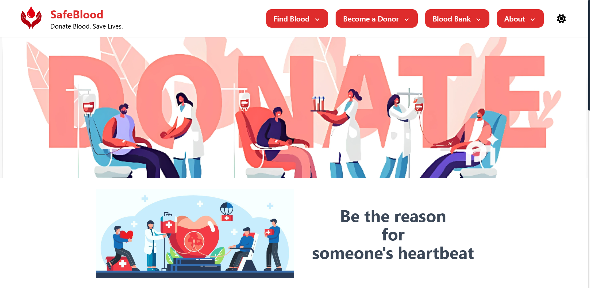
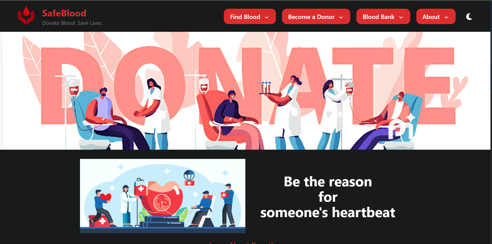
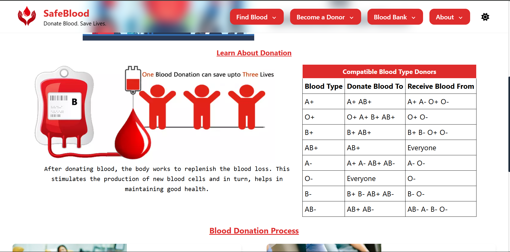
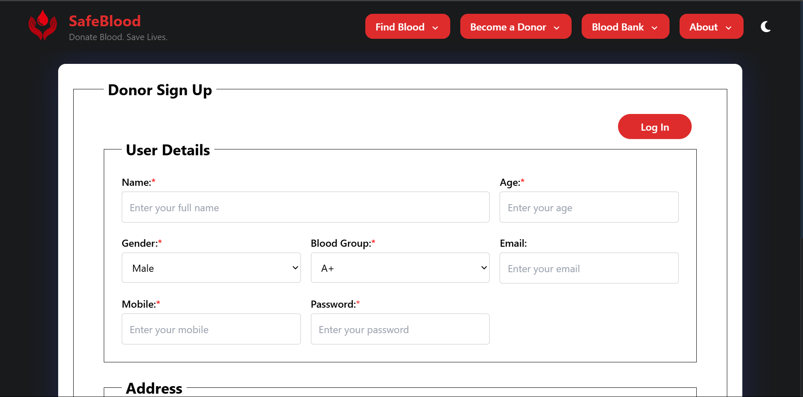
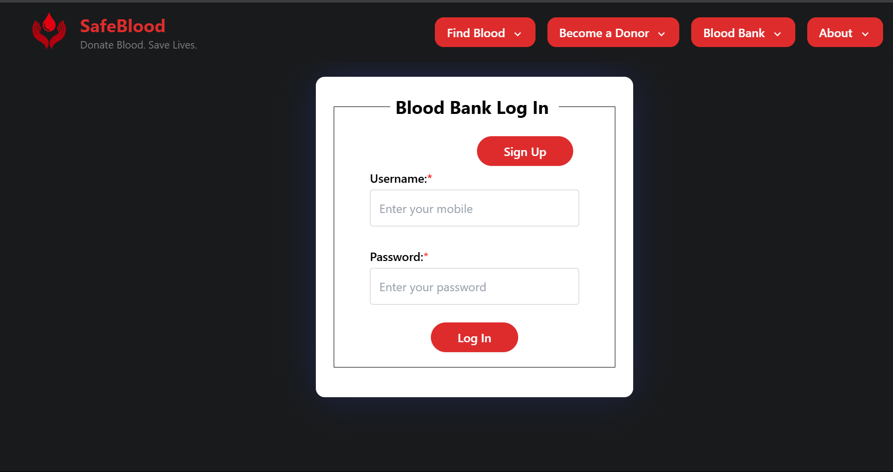
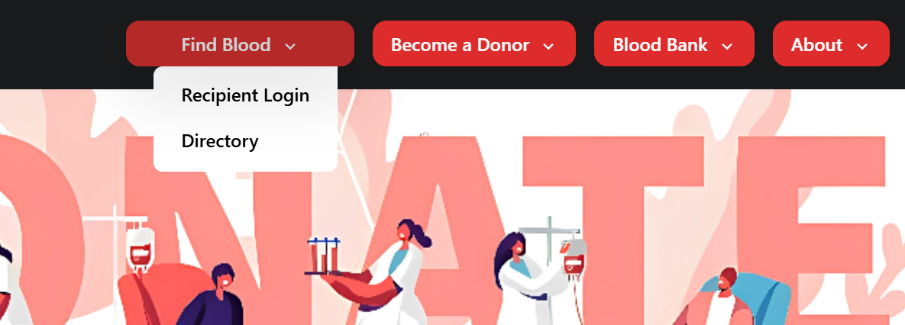
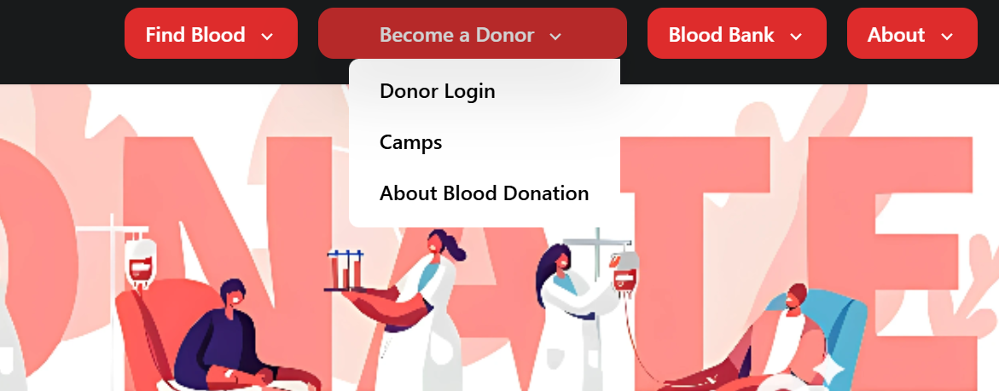
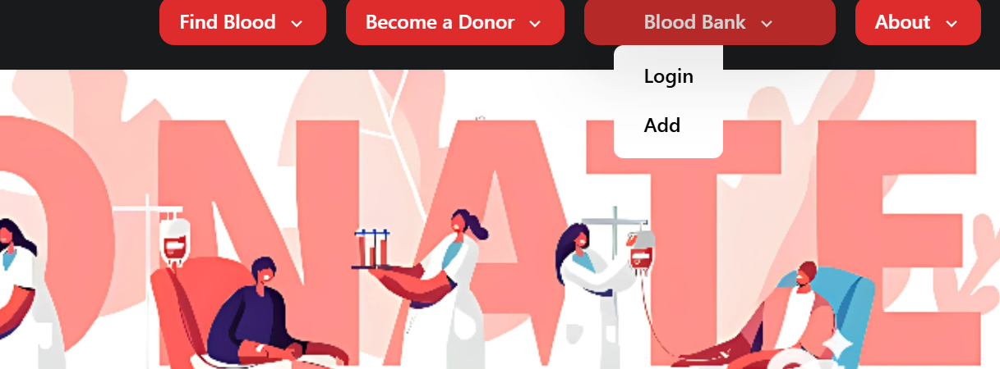

# SafeBlood

A full-stack MERN web application that connects users, blood donors, hospitals, and blood banks in real-time during emergencies. SafeBlood ensures timely access to blood by leveraging geolocation, role-based access, and instant notifications.

---

## Features

- Real-time blood availability tracking
- Role-based login for hospitals, blood banks, and donors
- Emergency notification system
- Reward-based donor system
- Mobile-friendly responsive UI

---

## Screenshots

### Home Page - Light  


### Home Page - Dark  


### Scrolled Home Page - Light  


### Login / Signup  
- Patient  
  
- Donor  
  
- Blood Bank  
  

### Menu Options  
- Find Blood  
  
- Become a Donor  
  
- Blood Bank Access  
  

---

## Tech Stack

**Frontend:**
- React.js
- Tailwind CSS

**Backend:**
- Node.js
- Express.js
- MongoDB + Mongoose

**Others:**
- JWT for authentication
- dotenv for environment variables
- MongoDB Atlas (cloud-hosted database)

---

## Folder Structure

```bash
SafeBlood/
├── client/         # React frontend
├── backend/        # Express backend
├── screenshots/    # App screenshots
└── README.md
```

---

## Setup Instructions:

### 1. Clone the Repository

```bash
git clone https://github.com/sahaj1136/SafeBlood-MERN.git
cd SafeBlood
```

### 2. Install Dependencies

## Frontend (React)

```bash
cd client
npm install
```

## Backend (Node.js + express)

```bash
cd ../backend
npm install
```

### 3. Setup Environment Variables

Create a .env file in the backend/ directory and add the following:

```bash
PORT=5000
MONGO_URI=your_mongo_connection_string
JWT_SECRET=your_jwt_secret
```

### 4. Run the Application

##Start Backend Server

```bash
cd backend
npm run dev
```

##Start Frontend Dev Server

```bash
cd ../client
npm start
```

### 5. Access the Application

```bash
Frontend: http://localhost:3000
Backend: http://localhost:5000
```
